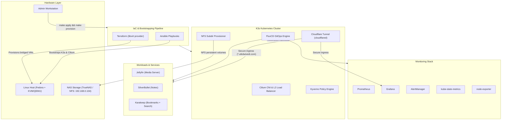

# Homelab — GitOps Kubernetes Cluster

[](https://github.com/utkdwivedi/homelab/tags)
[](https://homelab.khuedoan.com)
[](https://www.gnu.org/licenses/gpl-3.0.html)
[](https://github.com/utkdwivedi/homelab)

An automated, declarative **K3s Kubernetes homelab** running self-hosted services with end-to-end Infrastructure as Code (IaC) and GitOps reconciliation.

Maintained by **Utkarsh Dwivedi** ([@utkdwivedi](https://github.com/utkdwivedi)).

---

## Overview

This repository automates the entire lifecycle of a production-grade homelab cluster:
- **Bare-metal & Virtualization**: Host provisioning with Fedora, KVM/QEMU, and libvirt.
- **Infrastructure as Code**: Terraform module to spin up bridged Fedora Cloud VMs with cloud-init.
- **Configuration Management**: Ansible playbooks for system hardening, K3s installation, Cilium CNI bootstrapping, and storage configuration.
- **GitOps Continuous Delivery**: FluxCD controllers reconciling cluster state directly from this Git repository.
- **Observability**: Complete monitoring stack with Prometheus, Grafana, AlertManager, kube-state-metrics, and node-exporter.
- **Policy Enforcement**: Kyverno validating policies for resource boundaries.
- **Encrypted Secrets**: SOPS + age encryption integrated directly with FluxCD and Ansible Vault.
- **Zero-Trust Access**: Cloudflare Tunnel for secure external connectivity without opening firewall ports.

---

## Architecture



---

## Setup & Deployment

### Prerequisites

| Item | Default Value | Description |
|------|---------------|-------------|
| **Production Host IP** | `192.168.0.111` | Primary Fedora virtualization host |
| **Staging Host IP** | `192.168.0.109` | Optional staging virtualization host |
| **NAS Storage IP** | `192.168.0.104` | NFS server hosting persistent volume shares |
| **Cilium LB IP Pool** | `192.168.0.200/29` | IP range allocated for cluster load balancers |

> [!NOTE]
> If your local network configuration differs, adjust the IPs in `Makefile`, `scripts/env.sh`, and `provisioning/terraform/*/variables.tf`.

1. **Prepare Fedora Host:**
   - Fresh install of Fedora Server or Workstation.
   - Connected via Ethernet (required for NetworkManager `br0` bridge).
   - Ensure hardware virtualization (VT-x / AMD-V) is enabled in BIOS.
   - Add your workstation SSH key to `~/.ssh/authorized_keys`.

2. **Configure Terraform Variables:**
   Create `terraform.tfvars` under `provisioning/terraform/production` (and `staging/` if using dual environments):
   ```hcl
   # Credentials
   server_password = "YOUR_VM_PASSWORD"
   ssh_keys = [
     "YOUR_PUBLIC_SSH_KEY"
   ]

   # Node Specifications
   node_count    = 3
   vm_memory     = "4096"
   vm_vcpu       = 2
   user_name     = "server"
   hostname_base = "k3s-node"
   env           = "production"
   host_ip       = "192.168.0.111"
   ```

3. **Ansible Secrets & SOPS Key:**
   - Ensure an age keypair is generated: `age-keygen -o key.txt`
   - Place public key in `.sops.yaml`.
   - Store the age private key and your GitHub PAT in Ansible Vault (`provisioning/ansible/inventory/group_vars/all/secrets.yml`).

4. **Execute Provisioning Pipeline:**
   ```bash
   source scripts/env.sh   # Sets up environment variables and SSH agent

   make provision-host     # Configures KVM/libvirt, bridge (br0), and base packages
   make apply              # Deploys VMs using Terraform
   make provision          # Bootstraps K3s, Cilium CNI, and FluxCD
   ```

5. **External Ingress via Cloudflare Tunnel:**
   Services are exposed securely using Cloudflare Zero-Trust Tunnel (no open inbound router ports required):
   - Create a tunnel in Cloudflare Zero Trust Dashboard.
   - Add the tunnel token into `infrastructure/base/networking/secret.sops.yaml` using SOPS.
   - Point your domain CNAMEs to `<tunnel-id>.cfargotunnel.com`.

---

## Repository Structure

```
.
├── clusters/                # FluxCD GitOps entrypoints
│   ├── production/          # Production cluster kustomizations
│   └── staging/             # Staging cluster kustomizations
├── infrastructure/          # Core Kubernetes infrastructure
│   ├── base/                # Base manifests
│   │   ├── kyverno/         # Policy engine deployment
│   │   ├── namespaces/      # Cluster namespaces
│   │   ├── networking/      # Cilium IP pool, L2 policies, Cloudflare Tunnel
│   │   └── storage/         # NFS subdir external provisioner & StorageClasses
│   ├── production/          # Environment overlays
│   └── staging/
├── monitoring/              # Observability stack
│   ├── base/
│   │   ├── alertmanager/    # Alert routing
│   │   ├── grafana/         # Dashboards and visualization
│   │   ├── kube-state-metrics/
│   │   ├── node-exporter/   # Host metrics collector
│   │   └── prometheus/      # Metrics engine and storage
│   ├── production/
│   └── staging/
├── policies/                # Kyverno validation and governance policies
│   ├── base/
│   ├── production/
│   └── staging/
├── provisioning/            # Infrastructure as Code
│   ├── terraform/           # Libvirt/QEMU VM provisioning modules
│   └── ansible/             # Host and node configuration playbooks
├── resources/               # Dashboard templates & static assets
├── scripts/                 # Shell automation and environment helpers
├── services/                # Application workloads
│   ├── base/
│   │   ├── jellyfin/        # Media streaming
│   │   ├── karakeep/        # Bookmark manager with search & headless browser
│   │   └── silverbullet/    # Extensible markdown notebook
│   ├── production/
│   └── staging/
├── Makefile                 # Top-level orchestration
└── LICENSE                  # MIT License
```

---

## Tooling & Tech Stack

### Core Infrastructure
| Tool | Purpose |
|------|---------|
| **Fedora Linux** | Host OS and VM base image |
| **QEMU / KVM** | Type-1 hypervisor for lightweight virtualization |
| **K3s** | Lightweight certified Kubernetes distribution |
| **Cilium** | eBPF-based CNI providing L2 load balancing and network routing |
| **FluxCD** | Declarative GitOps continuous reconciliation engine |
| **Terraform** | Declarative VM provisioning via libvirt |
| **Ansible** | Automated host configuration and post-provisioning orchestration |
| **SOPS + Age** | Encryption for GitOps secrets stored safely in version control |

### Observability & Security
| Tool | Purpose |
|------|---------|
| **Prometheus** | Metrics collection, storage, and alerting |
| **Grafana** | Unified observability visualization |
| **AlertManager** | Alert deduplication and notification delivery |
| **Kyverno** | Kubernetes native policy-as-code management |
| **Cloudflare Tunnel** | Encrypted zero-trust ingress without public static IPs |

### Applications
| Service | Purpose | URL Route |
|---------|---------|-----------|
| **Jellyfin** | Personal media streaming | `jellyfin.utkdwivedi.com` |
| **SilverBullet** | Markdown knowledge base | `notes.utkdwivedi.com` |
| **Karakeep** | Self-hosted bookmarks & MeiliSearch | `karakeep.utkdwivedi.com` |

---

## Storage & Backup Strategy

The cluster adheres to a **3-2-1 backup model**:
- **Primary Local Storage**: TrueNAS ZFS mirror pool over NFS (`192.168.0.104`).
- **Secondary Local Backup**: Periodic snapshots replicated to secondary external storage.
- **Offsite Backup**: Critical datasets synced offsite to cloud object storage.
- **Code & Configuration**: Entire cluster topology is version-controlled in Git.

---

## License

Distributed under the MIT License. See [LICENSE](LICENSE) for full details.
