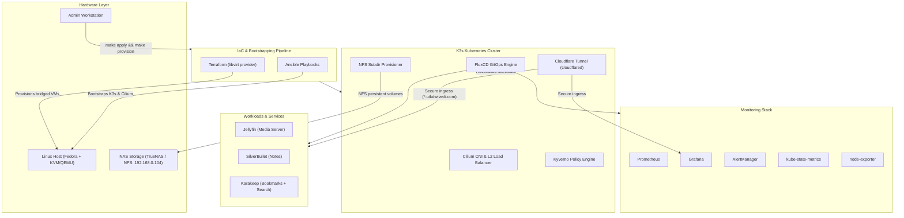

# Homelab — GitOps Kubernetes Cluster

[](https://homelab.khuedoan.com)
[](https://www.gnu.org/licenses/gpl-3.0.html)
[](https://github.com/utkdwivedi/homelab)

An automated, declarative **K3s Kubernetes homelab** running self-hosted services with end-to-end Infrastructure as Code (IaC) and GitOps reconciliation.

Maintained by **Utkarsh Dwivedi** ([@utkdwivedi](https://github.com/utkdwivedi)).

---

## Overview

This repository automates the entire lifecycle of a production-grade homelab cluster:
- **Bare-metal & Virtualization**: Host provisioning with Fedora, KVM/QEMU, and libvirt.
- **Infrastructure as Code**: Terraform module to spin up bridged Fedora Cloud VMs with cloud-init.
- **Configuration Management**: Ansible playbooks for system hardening, K3s installation, Cilium CNI bootstrapping, and storage configuration.
- **GitOps Continuous Delivery**: FluxCD controllers reconciling cluster state directly from this Git repository.
- **Observability**: Complete monitoring stack with Prometheus, Grafana, AlertManager, kube-state-metrics, and node-exporter.
- **Policy Enforcement**: Kyverno validating policies for resource boundaries.
- **Encrypted Secrets**: SOPS + age encryption integrated directly with FluxCD and Ansible Vault.
- **Zero-Trust Access**: Cloudflare Tunnel for secure external connectivity without opening firewall ports.

---

## Architecture


```mermaid
flowchart TD
    subgraph Hardware ["Hardware Layer"]
        Host["Linux Host (Fedora + KVM/QEMU)"]
        NAS["NAS Storage (TrueNAS / NFS: 192.168.0.104)"]
        WS["Admin Workstation"]
    end

    subgraph IaC ["IaC & Bootstrapping Pipeline"]
        TF["Terraform (libvirt provider)"]
        Ansible["Ansible Playbooks"]
        TF -->|"Provisions bridged VMs"| Host
        Ansible -->|"Bootstraps K3s & Cilium"| Host
    end

    subgraph Cluster ["K3s Kubernetes Cluster"]
        Cilium["Cilium CNI & L2 Load Balancer"]
        Flux["FluxCD GitOps Engine"]
        Storage["NFS Subdir Provisioner"]
        Kyverno["Kyverno Policy Engine"]
        Cloudflare["Cloudflare Tunnel (cloudflared)"]
    end

    subgraph Apps ["Workloads & Services"]
        Jellyfin["Jellyfin (Media Server)"]
        SilverBullet["SilverBullet (Notes)"]
        Karakeep["Karakeep (Bookmarks + Search)"]
    end

    subgraph Observability ["Monitoring Stack"]
        Prom["Prometheus"]
        Graf["Grafana"]
        Alert["AlertManager"]
        KSM["kube-state-metrics"]
        NodeExp["node-exporter"]
    end

    WS -->|"make apply && make provision"| IaC
    IaC --> Cluster
    Flux -->|"Reconciles manifests"| Cluster
    Flux --> Apps
    Flux --> Observability
    Storage -->|"NFS persistent volumes"| NAS
    Cloudflare -->|"Secure ingress (*.utkdwivedi.com)"| Apps
    Cloudflare -->|"Secure ingress"| Graf
```

---

## Setup & Deployment

### Prerequisites

| Item | Default Value | Description |
|------|---------------|-------------|
| **Production Host IP** | `192.168.0.111` | Primary Fedora virtualization host |
| **Staging Host IP** | `192.168.0.109` | Optional staging virtualization host |
| **NAS Storage IP** | `192.168.0.104` | NFS server hosting persistent volume shares |
| **Cilium LB IP Pool** | `192.168.0.200/29` | IP range allocated for cluster load balancers |

> [!NOTE]
> If your local network configuration differs, adjust the IPs in `Makefile`, `scripts/env.sh`, and `provisioning/terraform/*/variables.tf`.

1. **Prepare Fedora Host:**
   - Fresh install of Fedora Server or Workstation.
   - Connected via Ethernet (required for NetworkManager `br0` bridge).
   - Ensure hardware virtualization (VT-x / AMD-V) is enabled in BIOS.
   - Add your workstation SSH key to `~/.ssh/authorized_keys`.

2. **Configure Terraform Variables:**
   Create `terraform.tfvars` under `provisioning/terraform/production` (and `staging/` if using dual environments):
   ```hcl
   # Credentials
   server_password = "YOUR_VM_PASSWORD"
   ssh_keys = [
     "YOUR_PUBLIC_SSH_KEY"
   ]

   # Node Specifications
   node_count    = 3
   vm_memory     = "4096"
   vm_vcpu       = 2
   user_name     = "server"
   hostname_base = "k3s-node"
   env           = "production"
   host_ip       = "192.168.0.111"
   ```

3. **Ansible Secrets & SOPS Key:**
   - Ensure an age keypair is generated: `age-keygen -o key.txt`
   - Place public key in `.sops.yaml`.
   - Store the age private key and your GitHub PAT in Ansible Vault (`provisioning/ansible/inventory/group_vars/all/secrets.yml`).

4. **Execute Provisioning Pipeline:**
   ```bash
   source scripts/env.sh   # Sets up environment variables and SSH agent

   make provision-host     # Configures KVM/libvirt, bridge (br0), and base packages
   make apply              # Deploys VMs using Terraform
   make provision          # Bootstraps K3s, Cilium CNI, and FluxCD
   ```

5. **External Ingress via Cloudflare Tunnel:**
   Services are exposed securely using Cloudflare Zero-Trust Tunnel (no open inbound router ports required):
   - Create a tunnel in Cloudflare Zero Trust Dashboard.
   - Add the tunnel token into `infrastructure/base/networking/secret.sops.yaml` using SOPS.
   - Point your domain CNAMEs to `<tunnel-id>.cfargotunnel.com`.

---

## Repository Structure

```
.
├── clusters/                # FluxCD GitOps entrypoints
│   ├── production/          # Production cluster kustomizations
│   └── staging/             # Staging cluster kustomizations
├── infrastructure/          # Core Kubernetes infrastructure
│   ├── base/                # Base manifests
│   │   ├── kyverno/         # Policy engine deployment
│   │   ├── namespaces/      # Cluster namespaces
│   │   ├── networking/      # Cilium IP pool, L2 policies, Cloudflare Tunnel
│   │   └── storage/         # NFS subdir external provisioner & StorageClasses
│   ├── production/          # Environment overlays
│   └── staging/
├── monitoring/              # Observability stack
│   ├── base/
│   │   ├── alertmanager/    # Alert routing
│   │   ├── grafana/         # Dashboards and visualization
│   │   ├── kube-state-metrics/
│   │   ├── node-exporter/   # Host metrics collector
│   │   └── prometheus/      # Metrics engine and storage
│   ├── production/
│   └── staging/
├── policies/                # Kyverno validation and governance policies
│   ├── base/
│   ├── production/
│   └── staging/
├── provisioning/            # Infrastructure as Code
│   ├── terraform/           # Libvirt/QEMU VM provisioning modules
│   └── ansible/             # Host and node configuration playbooks
├── resources/               # Dashboard templates & static assets
├── scripts/                 # Shell automation and environment helpers
├── services/                # Application workloads
│   ├── base/
│   │   ├── jellyfin/        # Media streaming
│   │   ├── karakeep/        # Bookmark manager with search & headless browser
│   │   └── silverbullet/    # Extensible markdown notebook
│   ├── production/
│   └── staging/
├── Makefile                 # Top-level orchestration
└── LICENSE                  # MIT License
```

---

## Tooling overview

### Hardware
| Logo | Device | Role |
|:-:|-----|-------------|
|  | Lenovo Thinkpad T14 Gen 1 | Production |
|  | Lenovo Thinkcentre M700 | Staging |
|  | HP EliteDesk 800 G2 SFF 2x1TB WD Red | NAS |
|  | Lenovo Legion 5 Slim | Workstation |

### Infrastructure
| Logo | Name | Description |
|:-:|-----|-------------|
|  | Fedora | Linux Distribution used on Host, VMs and Workstation |
|  | TrueNAS | Open-source unified storage operating system based on OpenZFS |
|  | QEMU/KVM | Hypervisor for running virtual machines |
|  | K3s | Lightweight Kubernetes engine |
|  | FluxCD | GitOps tool for managing Kubernetes declaratively |
|  | Terraform | IaC tool for provisioning infrastructure declaratively |
|  | Ansible | Automation tool for post-provisioning configuration and orchestration |
|  | SOPS | Secret OPerationS - tool for managing secrets |
|  | Cilium | Solution for providing, securing, and observing network connectivity |
|  | Kyverno | Unified Policy as Code solution |
|   | Cloudflare | Zero-Trust Tunnel for exposing services securely on a the internet |


### Monitoring
| Logo | Name | Description |
|:-:|-----|-------------|
|  | Prometheus | Scrapes infrastructure metrics for visualization in Grafana |
|  | AlertManager | Sends notifications and alerts based on Prometheus metrics |
|  | Grafana | Dashboard and visualization for metrics collected by Prometheus |
|  | kube-state-metrics | Exposes Kubernetes cluster-level metrics for Prometheus |
|  | node-exporter | Collects host-level metrics for Prometheus |
|  | k9s | CLI tool to interactively view Kubernetes resources |
|  | Uptime Kuma | Alternative monitoring running as TrueNAS App |

### Services
| Logo | Name | Description |
|:-:|-----|-------------|
|  | Jellyfin | Media streaming service | 
|  | SilverBullet.md | Programmable browser-based Markdown editor |
|  | Karakeep | Bookmark manager | 


### Backup Strategy

The homelab follows a **3-2-1 backup strategy**:

| Logo | Name | Description |
|:-:|-----|-------------|
|  | TrueNAS | Primary local storage - 2x 1TB WD Red ZFS mirror |
|  | External SSD | Secondary local copy for critical data |
|  | Backblaze B2 | Offsite cloud storage via TrueNAS Cloud Sync |

>[!TIP]
> Infrastructure configs and other version-controlled assets also live on GitHub, adding a fourth copy for the most critical data.


## License

Distributed under the MIT License. See [LICENSE](LICENSE) for full details.
